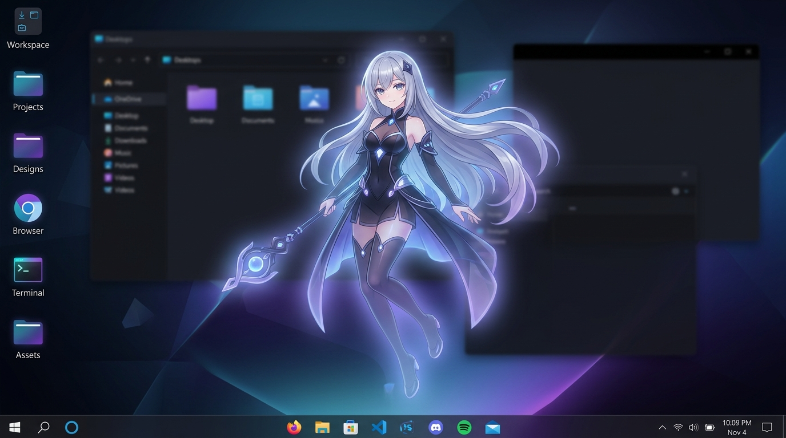
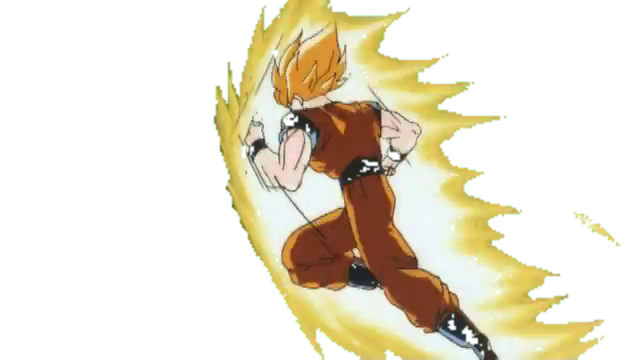

# ⚠️ THIS PROJECT IS FOR EDUCATIONAL PURPOSES ONLY ⚠️
### Created by Sachin

---

# Desktop Pet — Floating Character Desktop Overlay

An animated, always-on-top, transparent character overlay that floats across your desktop and taskbar. Built with Python, PyQt5, OpenCV, and `yt-dlp`.

---

## 📸 Visual Demo & Preview



*Above: Floating transparent character active on desktop screen and taskbar.*

### 🐉 Included Character: Goku


*Above: Goku green-screen video extracted into transparent overlay frames.*

---

## 🌟 Features & Highlights

- **🌊 Screen & Taskbar Floating Physics**: The character continuously floats across your monitor screens, floats over your Windows taskbar, and can dip up to 50% off-screen before bouncing back smoothly!
- **🟢 Automatic Green Screen Removal**: Automatically keys out green-screen backgrounds from `.mp4`, `.mov`, `.webm`, and `.avi` videos frame-by-frame into transparent overlay frames.
- **🔗 Online Video Link Downloader**: Paste any YouTube, TikTok, Twitter, or direct MP4 link! The app automatically downloads the video, removes its green screen, and floats the sprite immediately.
- **📐 500% Size Scaling Options**: Easily change character size from 50% (100px) up to **500%** (1000px height), or enter any custom size up to 2000px!
- **🚀 1-Click Silent Launchers**: Includes `Run Desktop Pet.vbs` for 1-click silent startup without terminal windows or Windows Smart App Control security prompts.
- **⚡ Playback & Speed Controls**: Adjust animation and screen floating speed from **0.10x** (slow motion) up to **5.0x** (ultra fast), or set custom speeds!
- **🖥️ Auto-Hide on Fullscreen**: Automatically hides when watching a fullscreen video or playing a fullscreen game, and reappears when done.

---

## 🚀 How to Run (Choose Any Method)

### Method 1: 1-Click Silent Launcher (Recommended)
Double-click **[`Run Desktop Pet.vbs`](file:///c:/Users/sachi/OneDrive/Desktop/desktop_pet/desktop_pet/Run%20Desktop%20Pet.vbs)** in the project folder.
- Launches silently with **0 terminal windows** and **0 security warnings**.

### Method 2: Standalone Executable
Double-click **[`DesktopPet.exe`](file:///c:/Users/sachi/OneDrive/Desktop/desktop_pet/desktop_pet/DesktopPet.exe)**.

### Method 3: Python Command Line
Open your terminal in this directory and run:
```bash
python main.py
```

---

## 🖱️ User Guide & Menu Options

### Right-Click Context Menu
Right-click on the floating character to open the control menu:

| Option | What it Does |
| :--- | :--- |
| **Hide** | Hides the character. (Bring it back anytime from the System Tray icon in the bottom-right of your taskbar). |
| **Stop / Resume Animation** | Freezes or unfreezes video/GIF playback. |
| **Float Across Screen** | Toggles automatic screen floating/roaming on or off. |
| **Change Size** | Choose preset scale (`50%`, `75%`, `100%`, `150%`, `200%`, `300%`, `400%`, `500%`) or enter a Custom pixel height. |
| **Opacity** | Set character transparency (`25%`, `50%`, `75%`, `100%`). |
| **Speed** | Set playback & roaming speed (`0.10x`, `0.25x`, `0.5x`, `0.75x`, `1x`, `1.5x`, `2x`, `3x`, `4x`, `5x`, or Custom Speed). |
| **Add Video / Image...** | Select a local `.png`, `.gif`, `.mp4`, `.mov`, or `.webm` file. |
| **Add Video from Link...** | Paste a YouTube or video link to automatically download, key out green screen, and display. |
| **Choose Character** | Switch between all characters in your media library. |
| **Exit** | Completely closes the desktop pet. |

### Left-Click Dragging
Click and drag the character with the left mouse button to move it anywhere on your screen. Screen roaming automatically pauses while dragging and resumes when released.

---

## ⚙️ Customization & Green-Screen Tuning

Settings are saved automatically in `config.json`. If a green screen video leaves a green fringe or cuts into your character, open `config.json` and adjust the HSV chroma bounds:

```json
"chroma_lower": [35, 40, 40],
"chroma_upper": [90, 255, 255]
```

- Lower the first number (`35`) if the green screen is yellow-green.
- Increase the first number if it leans toward teal.

---

## 📁 Project Structure

```
desktop_pet/
├── main.py                 # Application entry point
├── pet_window.py           # Floating window & right-click menu system
├── video_downloader.py     # Asynchronous yt-dlp video link downloader
├── video_utils.py          # OpenCV green screen removal engine
├── fullscreen_watcher.py   # Windows API fullscreen app detector
├── config_manager.py       # Configuration manager
├── config.json             # Saved user preferences & media library
├── Run Desktop Pet.vbs     # Silent 1-click launcher
├── Run_Desktop_Pet.bat     # Batch launcher
├── DesktopPet.exe          # Compiled standalone executable
└── assets/                 # Downloaded characters & video assets
```

---

## 💻 Developer Installation

Requirements: Python 3.9+ on Windows.

```bash
pip install -r requirements.txt
python main.py
```

---

## 📜 Disclaimer

This project is created strictly for **educational purposes only**. All character art and video media belong to their respective creators.
